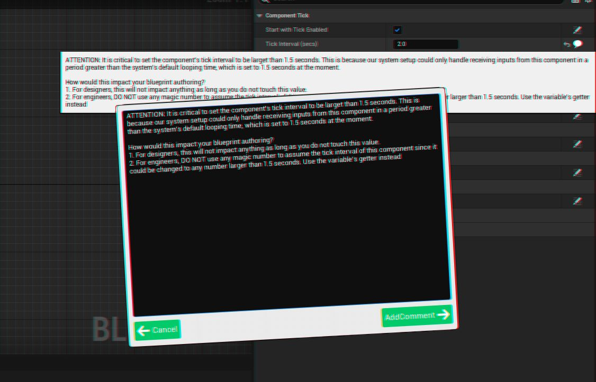
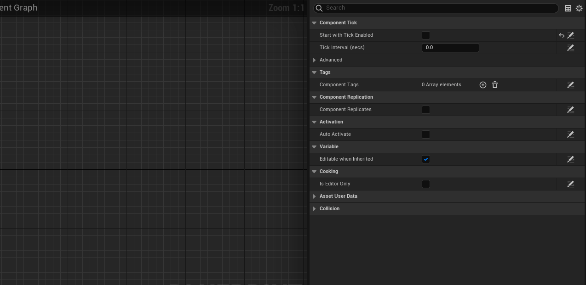
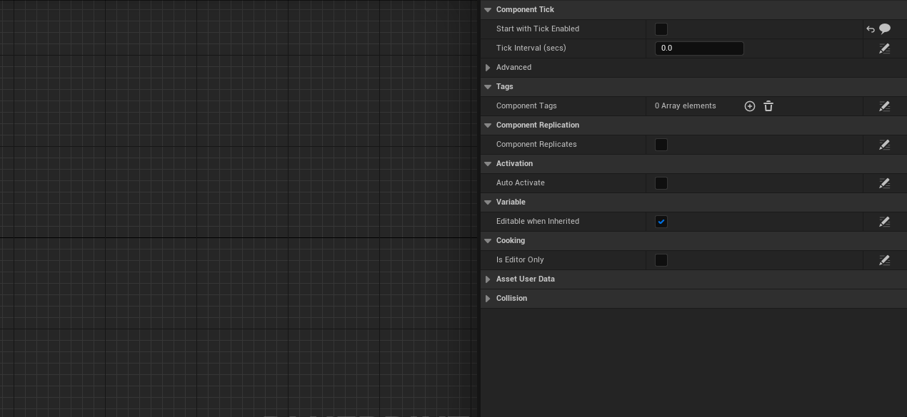
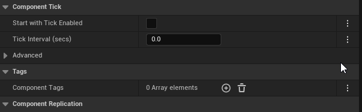
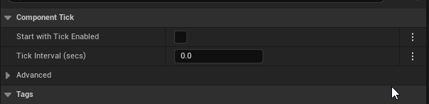

# Blueprint Property Comment Plug-In

Have you ever been scratching your head when trying 
to figure out why a certain property was set to a specific 
value? 

Are you tired of reaching out to co-workers for asking
why they set up property values in such a way you do not understand?

Have you ever wanted the ability to leave comments on properties
so collaborators will not accidentally overwrite an important value
you have set up?

If you have ever been experiencing any of the aforementioned situation, you
have come to the right place. The "Blueprint Property Comment" Plug-In is
as straightforward as it sounds: It allows you to leave comments on individual
properties!

 

## Adding Comments
You only need to click on the "Click to add comment" button at the end of the property details
row, type in your comment and hit "Add Comment".

 

## Removing Comments
If there is already a comment added to a given property, you can do the same as "Adding Comments" above.
This time, there will be a "Remove" button appearing next to "Add Comment". Upon clicking on it, you will
be prompt with a confirmation message dialog. Hit "OK" to confirm the removal of the previous comment.

 

## FAQ
**1. Will my blueprints become larger when I add more comments?**

Sure. Eventually these comments will be saved with the blueprint. Hence the blueprint will
take more space to store them. However, they are **editor only data**, meaning that they will be stripped
out of packaged builds. So, your shipped product will take the same space no matter how many
comments you added to any of the blueprints that get packaged.

 

**2. What is the performance impact this Plug-In will have on my project?**

The editor will be marginally slower due to the extra overhead in fetching comments for properties.
However, they are entirely negligible and you will not notice any slow-down of your editor. 

For PIE and packaged builds, there will be **zero** difference in performance because this Plug-In is an
editor extension, and does not participate in game logic at all.

 

**3. Why I can't see the comment buttons inside my blueprint?**

The buttons are probably collapsed into the kebab menu (three-dots menu) at the end of the details row.
You can either click on the menu and choose "Add Comment", or expand the button section.

 
